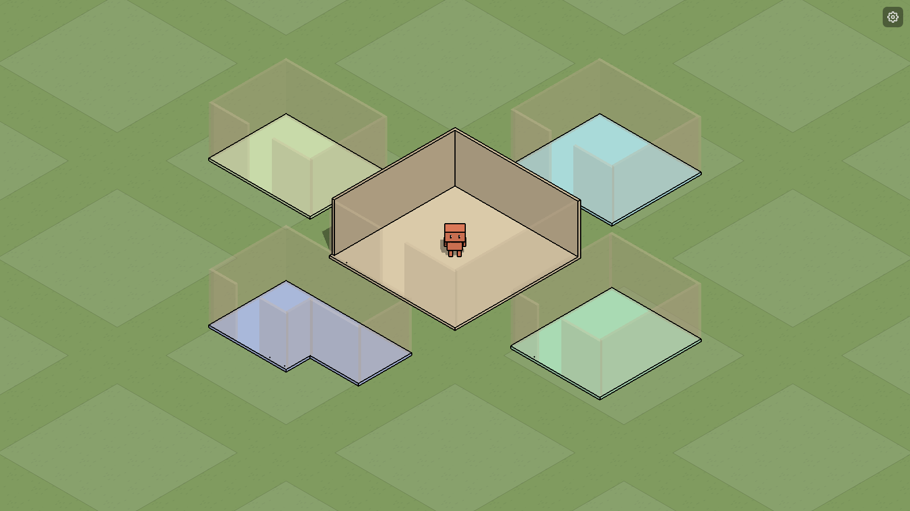

# Astro

Um escritório virtual onde IAs resolvem tarefas repetitivas, e dá pra ver elas trabalhando.



Cada sala é um workspace. A ideia é que os agents andem pelo escritório e passem de sala em sala conforme pegam tarefas (financeiro, suporte, relatórios, dev...). Assim dá pra acompanhar o que cada IA está fazendo olhando pra tela, sem ficar lendo log.

## Controles

- **WASD**: anda com o agent
- **Q / E**: gira a câmera 90°
- **Roda do mouse**: zoom
- **Botão direito numa sala**: editar (setas mudam o tamanho, `+` puxa um pedaço novo, `Esc` sai)

## Rodando

```sh
bun install
bun run tauri dev   # app desktop (Tauri)
bun run dev         # só no navegador
```

Feito com [Three.js](https://threejs.org/) + [Tauri](https://tauri.app/).
